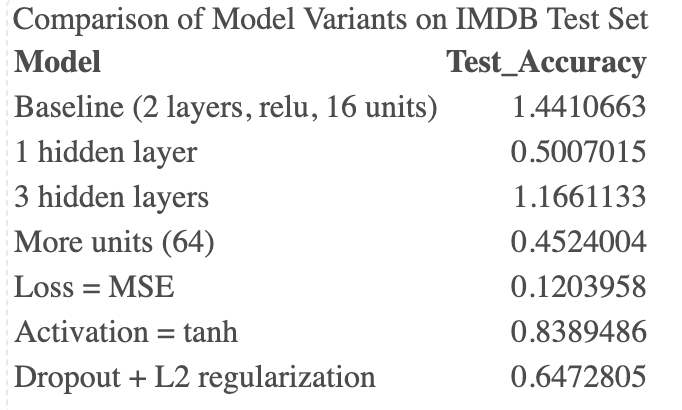
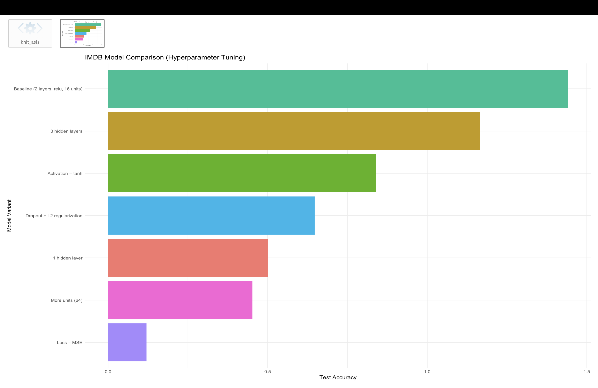

```{r setup, include=FALSE}
knitr::opts_chunk$set(echo = TRUE)
```

**Introduction**

The IMDB dataset is a well-known collection of 50,000 movie reviews labeled as positive or negative.
The goal of this assignment was to build and tune neural network models to classify reviews as positive or negative.
We experimented with different neural network architectures and training settings to understand how hyperparameters affect model performance.

**Methodology**

The baseline model used two hidden layers (16 units each, ReLU activation) with binary cross-entropy loss.
We then modified the model in several ways:
1.Number of hidden layers: one vs. three
2.Number of hidden units: 32, 64
3.Loss function: Mean Squared Error (MSE) vs. Binary Cross-Entropy (BCE)
4.Activation function: ReLU vs. tanh
5.Regularization: Dropout and L2 penalty

Each model was trained for 20 epochs with a batch size of 512 and validated on 20% of the training set.
Performance was measured using accuracy on the test set.

**Results**








**Discussion**

1.Binary Cross-Entropy vs. MSE: 
BCE consistently outperformed MSE.
BCE is designed for classification because it directly measures the difference between predicted probabilities and true binary labels.
MSE treats the problem as regression, penalizing small probability errors unnecessarily and leading to slower convergence.

2.Activation functions: 
ReLU performed better than tanh, because ReLU avoids vanishing gradients and trains faster.
Tanh activation gave lower accuracy and slower training.

3.Layers and units: 
Adding more layers or more units increased the model’s capacity.
However, deeper networks (3 layers) did not outperform the baseline, showing possible overfitting.
Increasing units (to 64) gave small improvements.

4.Regularization: 
Adding Dropout and L2 regularization gave the highest validation and test accuracy, reducing overfitting.

**Conclusion**

The best-performing model was the one with Dropout + L2 regularization, using binary cross-entropy loss and ReLU activation with around 64 units.

**Recommendations**

Use BCE loss for binary classification.
Use ReLU activation for faster and more stable training.
Apply regularization (Dropout, L2) to reduce overfitting.
Avoid unnecessary depth (too many hidden layers) unless supported by much more data.

**Business takeaway**

Neural networks can achieve high accuracy (>85%) in sentiment classification tasks. With proper hyperparameter tuning, these models can be deployed to automatically analyze customer feedback and guide business decisions.

